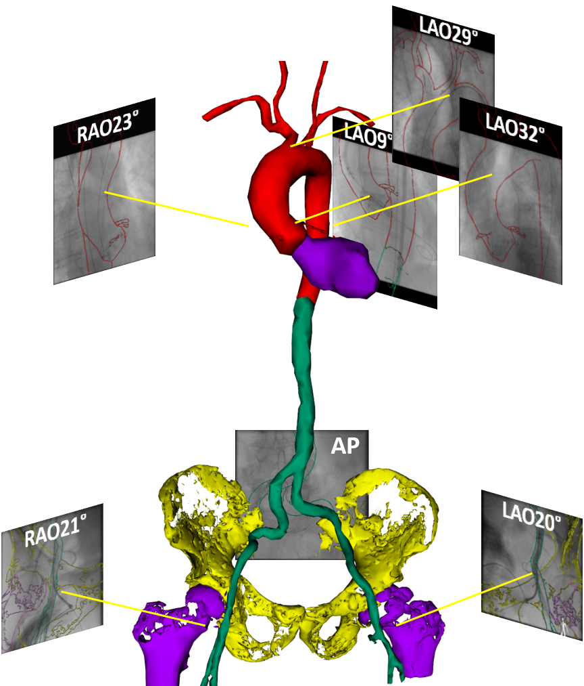
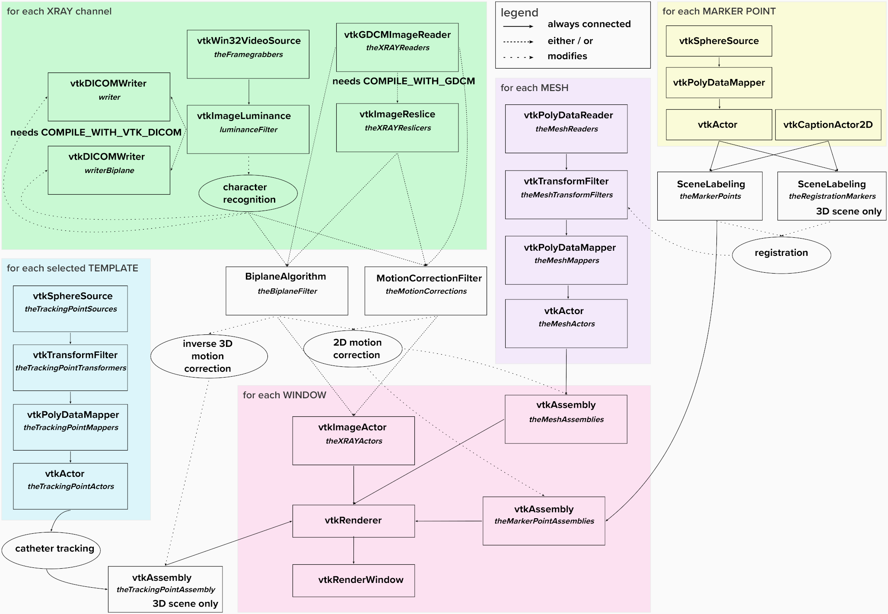
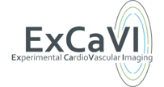

# 3D-XGuide : X-Ray Navigation Guidance Framework
<p align=center>


3D-XGuide is a software framework providing a foundation for rapid prototyping of new approaches in the field of XR navigation guidance.
Actual software release offers graphical user interface with basic functionality including data import and handling, calculation of projection geometry and transformations between related coordinate systems, rigid 3D-3D registration, and template-matching-based tracking and motion compensation algorithms in 2D and 3D.
Actual branch "DeepLearningMotionCompensation" provides additional motion compensation filter within the GUI for update of the model overlay dynamically based on values predicted by the CNN models developed with Keras. The developed CNN motion compensation models for prediction in x (NetX.h5) and y (NetY.h5) directions are packaged inside a web service server_model.exe. The communication is realized via the REST API using cURL and its corresponding open-source library. 

The implementation of 3D-XGuide from this repository is described in the following paper:
- Vernikouskaya I, Bertsche D, Rottbauer W, Rasche V. [3D-XGuide: open-source X-ray navigation guidance system.](https://link.springer.com/article/10.1007%2Fs11548-020-02274-0) Int J Comput Assist Radiol Surg. 2021;16(1):53-56

#### General
 - The core is written in C++
 - Freely available under the Simplified BSD License
 - Implements easily extendable data processing pipeline concept
 
The data processing pipeline defining interfaces between the single objects/algorithms is shown below
<p align=center>


#### Build system
 - The project and module configuration/generation is performed through [CMake](https://cmake.org/) (>= 3.16.2)
 - 3D-XGuide has been compiled with Visual Studio 2015
 
#### Dependencies
 - [VTK](https://www.vtk.org/) (>= 8.2.0) visualization pipeline is used as a core of framework
 - The GUI is based on [Qt](https://www.qt.io/) (>= 5.6.0)
 - DICOM is handled with [GDCM](https://github.com/malaterre/GDCM) (>= 2.6.0) and [VTK-DICOM](https://github.com/dgobbi/vtk-dicom/) (>= 0.8.9)
 - Image processing and tracking algorithms are implemented using [OpenCV](https://opencv.org/) (>= 3.0)
 - [libcurl](https://github.com/curl/curl/blob/master/docs/INSTALL.md#building-using-vcpkg) is used for communication with the CNN model via REST API.
 - [JSON](https://github.com/nlohmann/json) is used to extract values predicted by CNN from JSON string.

#### How to start
 - Download 3D-XGuide from releases section and unzip it
 - Run 3D-XGuide.exe to start the standalone application 
 - Download TestData from releases section and unzip it
 - Refer to [GettingStarted](GettingStarted.md) or go to Help menu within the standalone application for short user manual 

#### Serving CNN model for motion compensation with Flask
Download server_model.exe from Releases, then call one of the following endpoints to do prediction:
* ```/predict_x``` - to predict X coordinate only - ```curl -X POST -F image1=@1.png -F image2=@2.png 'http://localhost:5000/predict_x'```
* ```/predict_y``` - to predict Y coordinate only - ```curl -X POST -F image1=@1.png -F image2=@2.png 'http://localhost:5000/predict_y'```
* ```/predict_all``` - to predict both X and Y - ```curl -X POST -F image1=@1.png -F image2=@2.png 'http://localhost:5000/predict_all'```

#### Citation
If you use any part of this repository, please cite:
- Vernikouskaya I, Bertsche D, Rottbauer W, Rasche V. [3D-XGuide: open-source X-ray navigation guidance system.](https://link.springer.com/article/10.1007%2Fs11548-020-02274-0) Int J Comput Assist Radiol Surg. 2021;16(1):53-56

#### Further useful stuff
Python scripts for [XRAY Frame grabbing](https://github.com/vernikouskaya/Grabber).

#### Acknowledgements
3D-XGuide was developed within the [ExCaVI](https://www.uniklinik-ulm.de/innere-medizin-ii/experimentelle-forschung/experimental-cardiovascular-imaging-excavi/image-guided-interventions.html) group of Ulm University and Ulm University Medical Center. 

<p float="left">
<a href='https://www.uniklinik-ulm.de/innere-medizin-ii/experimentelle-forschung/experimental-cardiovascular-imaging-excavi.html'></a>
<a href='http://www.uni-ulm.de/en/'></a>
<a href='https://www.uniklinik-ulm.de/innere-medizin-ii.html'></a>
</p>
