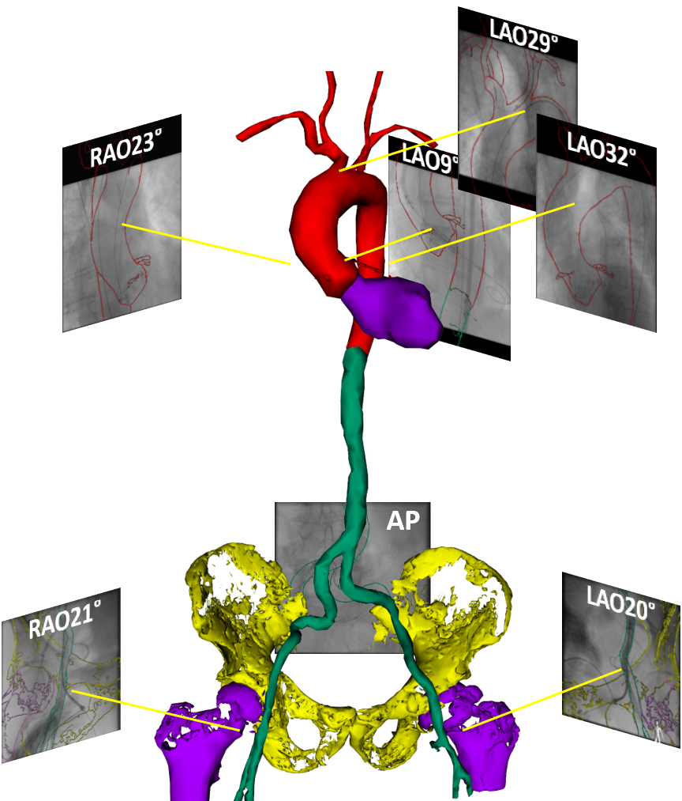

# 3D-XGuide : X-Ray Navigation Guidance Framework

3D-XGuide is a software framework providing a foundation for rapid prototyping of new approaches in the field of XR navigation guidance.
Actual software release offers graphical user interface with basic functionality including data import and handling, calculation of projection geometry and transformations between related coordinate systems, rigid 3D-3D registration, and template-matching-based tracking and motion compensation algorithms in 2D and 3D.

#### General
 - The core is written in C++
 - Freely available under the Simplified BSD License
 - Implements easily extendable data processing pipeline concept

#### Build system
 - The project and module configuration/generation is performed through [CMake](https://cmake.org/) (>= 3.16.2)
 - 3D-XGuide has been compiled with Visual Studio 2015
 
 #### Dependencies
 - [VTK](https://www.vtk.org/) (>= 8.2.0) visualization pipeline is used as a core of framework
 - The GUI is based on [Qt](https://www.qt.io/) (>= 5.6.0)
 - DICOM is handled with [GDCM](https://github.com/malaterre/GDCM) (>= 2.6.0) and [VTK-DICOM](https://github.com/dgobbi/vtk-dicom/) (>= 0.8.9)
 - Image processing and tracking algorithms are implemented using [OpenCV](https://opencv.org/) (>= 3.0)

#### How to start
 - Download and unzip the folder 3D-XGuide
 - Run 3D-XGuide.exe to start the standalone application 
 - Download und unzip the folder PHANTOM to get the test data 
 - Refer to GettingStarted or go to Help menu within the standalone application for short user manual 

#### Citation
If you use any part of this repository, please cite:

[Vernikouskaya I, Bertsche D, Rottbauer W, Rasche V (2019) Rapid Prototyping Framework for Image-Guided Interventions. Int J Comput Assist Radiol Surg 14(Suppl 1): S31-S32.](https://doi.org/10.1007/s11548-019-01969-3)

#### Acknowledgements
3D-XGuide was developed within the [ExCaVI](https://www.uniklinik-ulm.de/innere-medizin-ii/experimentelle-forschung/experimental-cardiovascular-imaging-excavi/image-guided-interventions.html) group of Ulm University and Ulm University Medical Center. 

